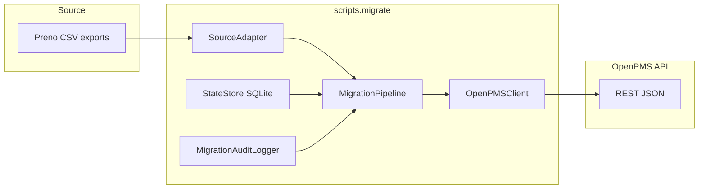

# OpenPMS migration CLI (`scripts.migrate`)

Imports historical data from **Preno** CSV exports into OpenPMS via the REST API.

## Architecture

The migration tool is a **Python package** under `scripts/migrate/` inside the OpenPMS backend repo. It does not run inside the FastAPI process; it is a **standalone CLI** that calls the same HTTP API as other clients.



| Component | Role |
|-----------|------|
| **`SourceAdapter`** | Abstract interface: `extract_*` + `validate()`. One implementation per source PMS (today: **`PrenoAdapter`**). |
| **`MigrationPipeline`** | Runs stages in order: room types → rooms → rate plans → rates → guests → bookings → verify. Coordinates **dry-run**, **resume**, **on-conflict**, batching, dedupe. |
| **`OpenPMSClient`** | Sync **httpx** client: JWT, retries (429 / 5xx), `POST`/`PATCH`/`GET` helpers. |
| **`StateStore`** | SQLite file for run id, per-stage status, processed guest/booking ids, name→UUID mappings. |
| **`MigrationAuditLogger`** | Structured lines to **stdout** and optional **`migration.log`**. |
| **`ReportGenerator`** | Text/JSON summary after each run. |

### Directory layout

```
scripts/migrate/
├── migrate.py              # CLI (Click)
├── core/
│   ├── adapter.py          # SourceAdapter ABC
│   ├── pipeline.py         # MigrationPipeline
│   ├── client.py           # OpenPMSClient
│   ├── state.py            # StateStore, compute_run_id
│   ├── audit_log.py        # migration.log format
│   └── report.py           # MigrationReport / ReportGenerator
├── adapters/
│   └── preno.py            # PrenoAdapter
├── models/
│   └── records.py          # GuestRecord, BookingRecord, …
└── tests/                  # pytest (unit + integration/)
```

## Prerequisites and installation

- **Python** 3.12+ (same as the OpenPMS project).
- From the **OpenPMS repository root**, use the project venv and install dependencies (the migration CLI reuses **`requirements.txt`** — it needs at least `httpx`, `pydantic`, `pandas`, `click`, `tenacity`).

```bash
cd /path/to/OpenPMS
python3 -m venv .venv
source .venv/bin/activate   # or .venv\Scripts\activate on Windows
pip install -r requirements.txt
```

Runs always need **`PYTHONPATH=.`** (or install the package in editable mode) so that `scripts.migrate` resolves:

```bash
export PYTHONPATH=.
python -m scripts.migrate --help
```

## Quick start

**Dry-run** (no API token, no writes):

```bash
cd /path/to/OpenPMS
PYTHONPATH=. python -m scripts.migrate \
  --source preno \
  --property-id YOUR-PROPERTY-UUID \
  --guests './guests_export_*.csv' \
  --bookings './bookings_report_*.csv' \
  --dry-run
```

**Full import** (JWT with write scopes for guests, bookings, room types, rates, etc.):

```bash
PYTHONPATH=. python -m scripts.migrate \
  --source preno \
  --api-url http://localhost:8000 \
  --api-token "$JWT" \
  --property-id YOUR-PROPERTY-UUID \
  --guests './guests_export_*.csv' \
  --bookings './bookings_report_*.csv' \
  --report ./migration-report.txt
```

**Resume** after interruption (same globs, property, and state path; not compatible with `--dry-run`):

```bash
PYTHONPATH=. python -m scripts.migrate \
  --resume \
  --state ./migration_state.sqlite3 \
  --source preno \
  --api-url http://localhost:8000 \
  --api-token "$JWT" \
  --property-id YOUR-PROPERTY-UUID \
  --guests './guests_export_*.csv' \
  --bookings './bookings_report_*.csv'
```

Bookings are created with **`external_booking_id`** set to the Preno **Booking ID**; duplicates return HTTP **409** and are handled per **`--on-conflict`**.

Placeholder nightly rates are seeded with **`--default-night-rate`** (default `100.00`) for each `(room_type, rate_plan)` pair over the stay date range so **`POST /bookings`** pricing succeeds.

## CLI reference

All options (see also `python -m scripts.migrate --help`):

| Option | Default | Description |
|--------|---------|-------------|
| **`--source`** | (required) | Source system. Only **`preno`** is supported today. |
| **`--api-url`** | `http://localhost:8000` | OpenPMS API base URL (no trailing slash required). |
| **`--api-token`** | empty | JWT Bearer token. **Required** for non–dry-run. |
| **`--property-id`** | (required) | Target property UUID. |
| **`--guests`** | none | Glob for Preno **`guests_export_*.csv`**. |
| **`--bookings`** | none | Glob for Preno **`bookings_report_*.csv`**. |
| **`--rooms`** | none | Optional path to a single **`rooms_export.csv`** (otherwise rooms are inferred from bookings). |
| **`--dry-run`** | off | Parse and simulate only; no HTTP writes, no state file. |
| **`--on-conflict`** | `skip` | `skip` \| `update` \| `fail` for guest/booking duplicates (see below). |
| **`--include-cancelled`** | off | Include cancelled Preno booking rows in **`extract_bookings`**. |
| **`--batch-size`** | `50` | Chunk size for guest/booking progress logging (per-record POSTs unchanged). |
| **`--default-night-rate`** | `100.00` | Decimal string for **`/rates/bulk`** seeding. |
| **`--report`** | none | Write text report; also writes **`.json`** next to it. |
| **`--resume`** | off | Continue from **`--state`** SQLite (skip completed stages / processed entities). |
| **`--state`** | `migration_state.sqlite3` | SQLite state DB path. |
| **`--log-file`** | `migration.log` | Structured audit log path. |
| **`--no-log-file`** | off | Audit only to stdout. |
| **`--log-level`** | `INFO` | `DEBUG` \| `INFO` \| `WARNING` \| `ERROR` for audit logger. |
| **`--precheck-bookings`** | off | **`GET /bookings?external_booking_id=…`** before POST. |
| **`-v` / `--verbose`** | off | More verbose **root** logging (not only audit). |

### Exit codes

| Code | Meaning |
|------|---------|
| **0** | **`SUCCESS`** (no fatal pipeline error). |
| **1** | **`FAILED`**. |
| **2** | **`PARTIAL`** (finished with non-fatal errors in the report). |

## State file and resume (v1.1)

Progress and idempotency for **guests** and **bookings** (plus room type / rate plan name → UUID mappings) are stored in a **SQLite** file.

- **`--state`** — path to the SQLite DB (default: `./migration_state.sqlite3`).
- **`--resume`** — skip pipeline stages already marked `done`, and skip guests/bookings already recorded in state.

The **run id** is derived from **`--property-id`** and resolved paths + mtimes of input CSV files, so the same import uses the same state file across restarts.

`--resume` cannot be combined with `--dry-run`.

To run a **fresh** full import with the same CSVs, remove or rename the state file (otherwise the same run id reuses old progress).

## Structured log (`migration.log`, v1.1)

Audit lines follow TZ §7:

`timestamp | stage | entity | source_id | result | details`

- **`--log-file`** — file path (default `./migration.log`).
- **`--no-log-file`** — log only to stdout (no file).
- **`--log-level`** — `DEBUG`, `INFO`, `WARNING`, `ERROR` for the audit logger.
- **`-v` / `--verbose`** — raises general app loggers to `DEBUG` (HTTP library noise may increase).

## Rate limiting (v1.2)

The migration HTTP client (`OpenPMSClient`) retries transient failures with **tenacity**:

- Up to **5** attempts per request.
- **HTTP 429**: respects **`Retry-After`** when present (seconds or HTTP-date); otherwise exponential backoff **1 → 2 → 4 → 8 → 16** seconds.
- **HTTP 5xx** and **transport errors**: same exponential backoff.
- Retries are logged on the logger **`openpms.migration.client`** at **WARNING** (`retry status=… wait=…`).

## Deduplication (v1.2)

- **Guests (source)**: before POST, rows with the same real **email** (non-synthetic) are collapsed to a single row (first by `external_id`); duplicates are counted as **`skipped`** on the guests stage and emit `source_dup` audit lines. Synthetic emails (`…@migrate.openpms.local`) are not collapsed by email.
- **Guests (OpenPMS)**: for real emails, the client runs **`GET /guests?q=<email>`** and applies **`--on-conflict`** when an exact email match exists. Mappings **`guest_email`** → OpenPMS guest id are stored in **`--state`** SQLite to avoid repeat lookups.
- **Bookings**: optional **`--precheck-bookings`** calls **`GET /bookings?external_booking_id=…`** before **`POST /bookings`**. Without the flag, duplicates are still detected via **HTTP 409** on `external_booking_id` (P0 behavior).

## On-conflict strategies (v1.2)

**`--on-conflict`** applies to **guests** and **bookings** only (`skip` | `update` | `fail`):

| Mode | Guests | Bookings |
|------|--------|----------|
| **skip** (default) | Skip when the email already exists (preflight or 409). | Skip on 409; with **`--precheck-bookings`**, count as **existed** when found. |
| **update** | **`PATCH /guests/{id}`** with non-empty `phone`, `notes`, `nationality`, `vip_status`. | **`PATCH /bookings/{id}`** with **`status`** when it differs from the source row (invalid transitions may log a **WARNING**). |
| **fail** | Abort the run on the first duplicate (**`OnConflictFailError`** → report **`FAILED`**). | Same. |

Example with pre-check and update-on-duplicate:

```bash
PYTHONPATH=. python -m scripts.migrate \
  --source preno \
  --api-url http://localhost:8000 \
  --api-token "$JWT" \
  --property-id YOUR-PROPERTY-UUID \
  --guests './guests_export_*.csv' \
  --bookings './bookings_report_*.csv' \
  --on-conflict update \
  --precheck-bookings
```

## Batching / progress (v1.2)

**`--batch-size`** (default **50**) chunks **guest** and **booking** processing for progress logging: after each chunk, stdout logs `guests progress:` / `bookings progress:` and the audit logger records a **`progress`** / **`chunk_done`** line. Room bulk creation still uses API chunks of **200** (unchanged).

## Integration tests (MIG-19 / MIG-20)

Optional pytest tests under [`tests/integration/`](tests/integration/) are marked **`integration`** and **skip** unless env vars are set.

| Variable | Used for |
|----------|----------|
| `MIG_SATVA_DIR` | Directory containing `guests_export_*.csv` and `bookings_report*.csv` (Satva Samui export). |
| `MIG_OPENPMS_URL` | API base URL (e.g. `http://localhost:8000`). |
| `MIG_OPENPMS_TOKEN` | JWT with write scopes. |
| `MIG_PROPERTY_ID` | Target property UUID. |

Examples (from repo root, venv active):

```bash
# Integration dry-run only (no API writes)
export MIG_SATVA_DIR=/path/to/satva/csv
pytest -m integration scripts/migrate/tests/integration/test_dry_run_satva.py

# Full migration + resume idempotency (writes to OpenPMS)
export MIG_SATVA_DIR=...
export MIG_OPENPMS_URL=http://localhost:8000
export MIG_OPENPMS_TOKEN="$JWT"
export MIG_PROPERTY_ID="00000000-0000-0000-0000-000000000000"
pytest -m integration scripts/migrate/tests/integration/test_full_migration_localhost.py
```

Default CI / local run without these variables: **`pytest scripts/migrate/tests/`** — integration tests are skipped; extended **PrenoAdapter** unit tests in `test_preno_adapter_mapping.py` always run.

## Adding a new source adapter

1. **Subclass** [`SourceAdapter`](core/adapter.py) in a new module under [`adapters/`](adapters/) (e.g. `adapters/other_pms.py`).
2. **Implement** all abstract methods:
   - `extract_guests` → `list[GuestRecord]`
   - `extract_room_types` → `list[RoomTypeRecord]`
   - `extract_rooms` → `list[RoomRecord]`
   - `extract_rate_plans` → `list[RatePlanRecord]`
   - `extract_bookings` → `list[BookingRecord]`
   - `validate` → `ValidationResult` (set `ok=False` and add **`ValidationIssue`** entries for blocking problems).
3. Use **`GuestRecord`**, **`BookingRecord`**, etc. from [`models/records.py`](models/records.py) so the pipeline stays unchanged.
4. **Wire the CLI** in [`migrate.py`](migrate.py):
   - Add the new value to **`click.Choice`** for **`--source`**.
   - Instantiate your adapter when that source is selected (same pattern as **`PrenoAdapter`**).
5. **Tests**: add **`tests/test_<adapter>_adapter.py`** with small CSV or in-memory fixtures; keep **`validate()`** strict so bad paths fail fast.

Until a second adapter exists, **`--source preno`** is the only supported value.
